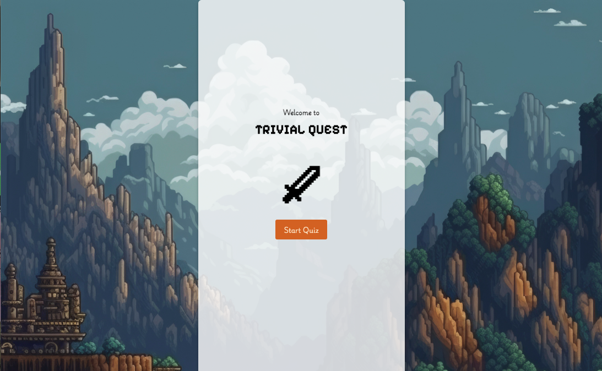
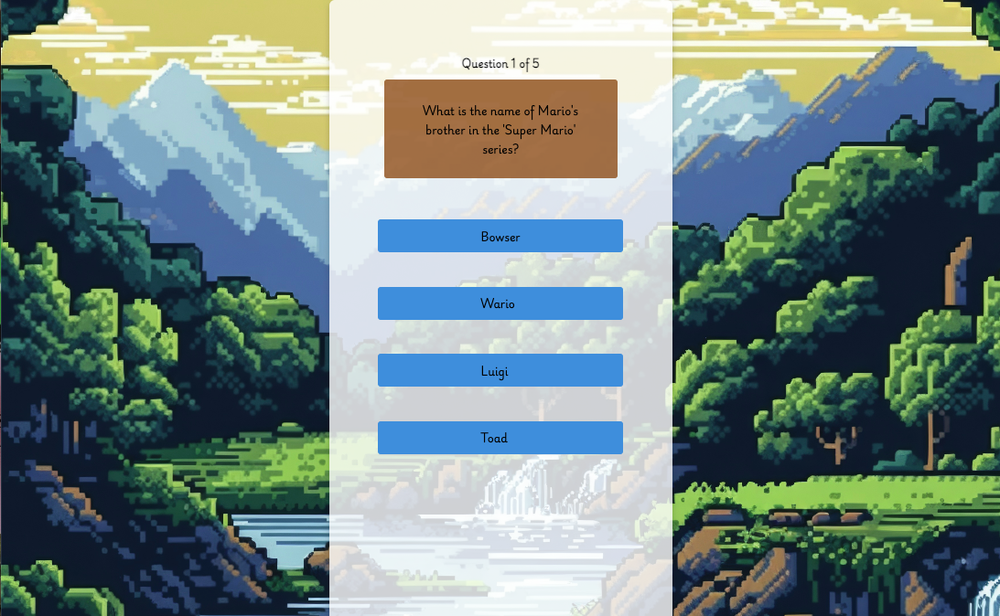

# Trivia Quest

The Trvia Quest is an engaging trivia quiz where users answer 5 random questions from various categories like anime, video games, fantasy books, and board games. After completing the quiz, the user is directed to a results page where their score is visually represented by heart icons, similar to classic video games. The final heart animates to highlight the user’s achievement. The quiz pulls random questions on every playthrough, ensuring that no two games are the same.

## Link
TBA

## Images

## Technologies:
- Frontend: React.js, TypeScript, SCSS
- Routing: React Router
- State Management: React Hooks (useState)
- Animation: CSS keyframes for heart and sword animation
- Deployment: Netlify
